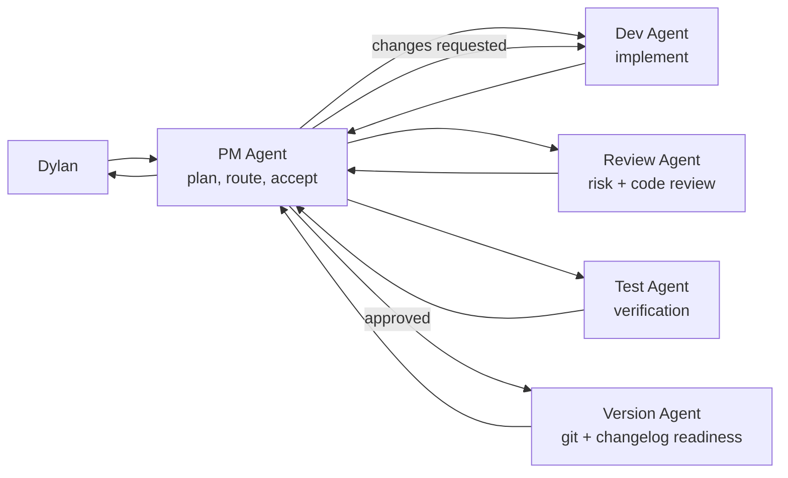

# Dylan Team Loop

<p align="center">
  <strong>Codex-first PM-led engineering team harness</strong>
  <br>
  Turn one project objective into routed Codex Agent work, review loops, verification, git readiness, and repo-local memory.
</p>

<p align="center">
  <a href="https://github.com/DylanZhangzzz/Dylan-Team-loop"></a>
  
  
  
</p>

<p align="center">
  <a href="#quick-install">Quick Install</a> |
  <a href="#why-team-loop">Why Team Loop</a> |
  <a href="#what-makes-it-different">Advantages</a> |
  <a href="#how-the-loop-runs">How It Runs</a> |
  <a href="#roles">Roles</a> |
  <a href="#bring-your-own-agents">Bring Your Own Agents</a> |
  <a href="#safety-model">Safety</a>
</p>

## What Is Dylan Team Loop?

Dylan Team Loop is a **Codex-first PM-led engineering team harness**.

It is not a generic agent framework and not an agent group chat. It is a lightweight repo-local operating system for Codex Desktop and Codex threads: Dylan gives the PM Agent an objective; PM routes structured work to role Agents; PM maintains the project state in `team-loop/progress.md`; Agents return results; logs land in the repo; and the loop stops when human approval is required.

```text
Dylan -> PM Agent -> Dev Agent -> Review Agent + Test Agent -> Dev repair loop -> Version Agent -> Dylan
```

It is built for real engineering work where you want the speed of multiple Agents without losing the thread: who was assigned what, what changed, what passed, what is blocked, and when Dylan must decide.

## Quick Install

Install the Codex skill from GitHub:

```bash
tmp="$(mktemp -d)"
trap 'rm -rf "$tmp"' EXIT

git clone --depth 1 https://github.com/DylanZhangzzz/Dylan-Team-loop.git "$tmp"
mkdir -p ~/.codex/skills/dylan-team-loop
rsync -a "$tmp"/ ~/.codex/skills/dylan-team-loop/
```

If the repository is private, authenticate GitHub access first, then run the same commands.

Or install from a local clone:

```bash
mkdir -p ~/.codex/skills/dylan-team-loop
rsync -a ./ ~/.codex/skills/dylan-team-loop/
```

Then restart Codex or start a fresh Codex thread so the skill is discovered.

## Initialize A Project

Create the project-local Team Loop workspace:

```bash
python3 ~/.codex/skills/dylan-team-loop/scripts/init_team_loop.py \
  --project-name "ExampleProject" \
  --project-path /path/to/project
```

This creates:

```text
team-loop/
  agent-profiles/
  knowledge/
  agents.json
  messages.ndjson
  commits.ndjson
  decisions.ndjson
  progress.md
  protocol.md
```

Before creating worktree-backed Dev or Test Agents, check whether the repo has a valid git `HEAD`:

```bash
python3 ~/.codex/skills/dylan-team-loop/scripts/check_worktree_ready.py \
  --project-path /path/to/project
```

If `readyForWorktree` is `false`, create an initial commit first or run Agents in the local project environment until a valid `HEAD` exists.

## Start The PM Agent In Codex

Open Codex in the target project and ask:

```text
Use the dylan-team-loop skill.

You are the PM Agent for this project.
Read team-loop/protocol.md, team-loop/agents.json, team-loop/progress.md,
and team-loop/agent-profiles/pm.md before acting.

Wait for my project objective before dispatching work.
```

Once Dylan approves a plan, the PM Agent defaults to routing `TEAMLOOP_MESSAGE v1` tasks to the role Agents and updating the project logs after each loop iteration. PM should not do implementation or documentation work inline when an appropriate live Agent thread exists.

## Why Team Loop

| Problem | Team Loop answer |
|---|---|
| Generic frameworks feel heavy | Install one Codex skill and initialize one `team-loop/` harness inside an existing repo |
| Agent group chats blur responsibility | PM, Dev, Test, Review, Version, Research, and UX have explicit lanes |
| One agent loses context over long work | PM keeps a living project dashboard in `team-loop/progress.md` |
| Parallel Agents create chaos | Every dispatch uses `TEAMLOOP_MESSAGE v1` with required return fields |
| Reviews happen too late | Review and Test Agents are part of the default loop |
| Worktrees fail on empty repos | Preflight detects missing `HEAD` before worktree creation |
| Automation can overreach | Admin boundaries require Dylan confirmation |
| Good prompts disappear in chat history | Role profiles and knowledge files live in the repo |

## What Makes It Different

### Codex-first, not concept-first

Many loop and multi-agent projects are powerful but abstract. Dylan Team Loop is designed to run directly in Codex Desktop with Codex threads: PM sends the task, the Agent replies, the PM logs the result, and the project state updates on disk.

### PM-led, not agent chat

AutoGen-style and crew-style systems often let Agents talk a lot while ownership gets fuzzy. Dylan Team Loop models a real small engineering team: PM plans and routes, Dev implements, Test verifies, Review audits, Version checks git/release readiness, Research investigates, and UX evaluates product flow.

### PM-maintained project progress

Unlike chat-only multi-agent setups, Dylan Team Loop keeps a PM-maintained project progress file. `team-loop/progress.md` is the living project dashboard: what is assigned, what came back, what is blocked, what needs human approval, and what happens next.

This is the active single source of truth for multi-agent work. It tracks:

- current state: `planned`, `assigned_dev`, `review_testing`, `changes_requested`, `approved`, `versioning`, `reported`;
- current loop iteration and limit;
- each Agent's status;
- recently dispatched tasks and returned results;
- blockers, risks, and Dylan decision needs;
- next action.

That makes the loop resilient to context drift and state loss.

### Repo-local memory

The `team-loop/` directory is the durable spine:

- `agents.json` records Agent threads, roles, workspace modes, and responsibilities.
- `messages.ndjson` records dispatches and response summaries.
- `decisions.ndjson` records approvals, scope changes, and escalations.
- `progress.md` is the PM-maintained project dashboard for state, assignments, returned results, blockers, decisions, loop limits, Agent status, and next action.

That makes the loop auditable, recoverable, and handoff-friendly in a way pure chat history is not.

### Safety boundaries for real engineering

The loop is intentionally not fully autonomous by default. Installing third-party skills, deleting or merging branches, rewriting public history, and making formal releases stop for Dylan approval. That makes it easier to trust the system on real repositories.

### Lightweight by default

No service, dashboard, database, or complex runtime is required. Install the skill, initialize the harness, create/register Codex role threads, and run the loop inside the repo you already have.

## How The Loop Runs



The PM Agent may loop automatically after Dylan approves the plan:

```text
PM -> Dev -> PM
PM -> Review + Test -> PM
PM -> Dev repair loop
PM -> Version -> PM
PM -> Dylan
```

For implementation and documentation tasks, PM sends the work to Dev first, then uses Review/Test and UX when appropriate, then asks Version for git, changelog, branch readiness, and safe push checks.

PM may act inline only for trivial read-only status checks, direct answers to Dylan, urgent admin clarification, or when no live Agent thread exists for the needed role.

The loop stops for Dylan when requirements are unclear, credentials or hardware are missing, repeated failures do not converge, or an admin action is required.

## Roles

| Agent | Default mode | Job |
|---|---:|---|
| PM | coordinator | Plans, routes, maintains project state, accepts work, reports to Dylan |
| Dev | worktree | Implements features, bug fixes, and scoped code changes |
| Test | worktree | Designs tests, reproduces bugs, and verifies acceptance criteria |
| Review | readonly | Reviews diffs, architecture risk, regression risk, and test quality |
| Version | readonly | Checks git status, commit scope, changelog, and release readiness |
| Research | readonly | Looks up docs, dependencies, options, and technical unknowns |
| UX | readonly | Reviews product flow, UI behavior, accessibility, and visual quality |
| FW | optional readonly | Firmware, embedded, hardware, RTOS, device logs |
| ML | optional worktree | Model selection, training strategy, evaluation, leakage risk |

Include firmware or ML roles at initialization:

```bash
python3 ~/.codex/skills/dylan-team-loop/scripts/init_team_loop.py \
  --project-name "FirmwareProject" \
  --project-path /path/to/project \
  --project-type firmware

python3 ~/.codex/skills/dylan-team-loop/scripts/init_team_loop.py \
  --project-name "MLProject" \
  --project-path /path/to/project \
  --project-type ml
```

## Bring Your Own Agents

Dylan Team Loop is the team operating system. [agency-agents](https://github.com/msitarzewski/agency-agents) can be an optional specialist talent pool.

Team Loop owns the PM-led project protocol and state layer: task dispatch, the Agent roster, `TEAMLOOP_MESSAGE v1`, `team-loop/progress.md`, messages and decisions audit logs, the Dev -> Review/Test repair loop, human approval gates, and Codex-first threads, worktrees, or local execution. It does not try to own every specialist persona.

Optional specialist libraries such as agency-agents can provide expert profiles, for example Security Engineer, Backend Architect, UX Researcher, Technical Writer, Performance Engineer, or other domain roles. At the reviewed upstream source, the agency-agents README describes a collection of AI agent personalities and reports 232 specialized agents across 16 divisions. Its agent files are Markdown/profile-style definitions, and its Codex integration can generate standalone TOML custom-agent files for `~/.codex/agents/`.

Team Loop can wrap approved specialists in its message contract so PM can dispatch them like any other role while keeping project state and audit logs local. Team Loop should not recommend running third-party convert/install scripts until they have been reviewed.

This is different from framework-centered tools:

| Layer | Role |
|---|---|
| AutoGen / CrewAI | General multi-agent orchestration frameworks |
| agency-agents | Optional role/profile library for specialist personas |
| Dylan Team Loop | PM-led project protocol, progress state, audit logs, and approval gates |

Specialist import is available in the local development CLI. It adapts approved local Markdown only; it does not fetch remote content, run upstream scripts, install Codex agents, or write outside the target `team-loop/` directory.

```bash
node bin/teamloop.js specialists import \
  --team-loop-dir /path/to/project/team-loop \
  --profile-file /path/to/approved-profile.md \
  --id security-engineer \
  --display-name "Security Engineer" \
  --source-name agency-agents \
  --source-repo https://github.com/msitarzewski/agency-agents \
  --source-ref 0123456789abcdef0123456789abcdef01234567 \
  --source-path engineering/security-engineer.md \
  --license MIT
```

The command defaults to dry-run and prints a JSON plan. `--profile-file` must point to a local `.md` or `.markdown` file. Add `--write --approved-by Dylan` only after Dylan has approved the source/ref/license metadata. This package is not currently documented as published to npm; use the local `node bin/teamloop.js ...` form from a checkout.

## TEAMLOOP_MESSAGE v1

Every cross-Agent dispatch uses the same searchable envelope:

```text
TEAMLOOP_MESSAGE v1
project: <project-name>
mode: <task|goal|review>
from_role: <pm|dev|test|version|review|research|ux|fw|ml>
to_role: <pm|dev|test|version|review|research|ux|fw|ml>
message_id: <timestamp-role-counter>
requires_response: <yes|no>
response_to: <message_id or none>
priority: <low|normal|high|urgent>

Context:
<short context>

Task:
<concrete request>

Acceptance:
- <observable result>
- <verification command or evidence required>

Return Format:
- Summary
- Files changed
- Commands run
- Risks/blockers
- Next recommended action
END_TEAMLOOP_MESSAGE
```

This makes Agent work auditable. Dispatches and response summaries go to `team-loop/messages.ndjson`; decisions go to `team-loop/decisions.ndjson`; version and commit events go to `team-loop/commits.ndjson`.

## Safety Model

The PM Agent may coordinate work and read Agent results after Dylan approves execution. It must stop for Dylan confirmation before:

- installing third-party skills;
- deleting or merging branches;
- rewriting public history;
- making a formal release;
- continuing when credentials, hardware, or product decisions are missing.

Version Agent may create branches, commits, and changelog/version edits only after PM approval. It may decide to push committed changes when the branch is clean, scope is intended, checks have passed, and the push is not a branch merge/delete, public history rewrite, or formal release.

A push is distinct from a merge or release: safe committed-change pushes are Version Agent judgment calls after readiness checks, while branch deletion, branch merge, public history rewrites, formal releases, and third-party skill installs require Dylan confirmation.

## Codex Support Today

Dylan Team Loop is Codex-first today:

- Codex skills live under `~/.codex/skills/`.
- Codex threads act as role Agents.
- Codex worktrees can isolate Dev/Test once the project has a valid `HEAD`.
- Codex thread tools can send and read Agent messages.

The method is designed to be portable, but only Codex support is documented as ready in this repository.

## Future Adapters

| Adapter | Status | Notes |
|---|---|---|
| Codex | supported now | Primary target for this skill |
| Claude Code | reserved | Feasible if role threads, skills, and message routing are mapped cleanly |
| Hermes | reserved | Feasibility depends on available Agent, state, and dispatch primitives |

## Recommended First Run

1. Install the skill.
2. Initialize `team-loop/` in a real project.
3. Create an initial git commit if the project has none.
4. Start a PM Agent thread in Codex.
5. Ask the PM to propose a plan.
6. Approve the plan.
7. Let PM run Dev -> Review/Test -> Version.
8. Read the final PM report and inspect the logs.

## Project Files As Memory

| File | Purpose |
|---|---|
| `team-loop/agents.json` | Role registry, thread IDs, workspace modes, responsibilities |
| `team-loop/progress.md` | PM-maintained project dashboard: state, loop iteration and limit, Agent status, recent dispatches/results, blockers, Dylan decision needs, next action |
| `team-loop/messages.ndjson` | Dispatches and response summaries |
| `team-loop/decisions.ndjson` | Dylan approvals, PM approvals, scope changes, escalations |
| `team-loop/commits.ndjson` | Commit proposals, branch actions, changelog/version checks |
| `team-loop/agent-profiles/*.md` | Role-specific operating instructions |
| `team-loop/knowledge/*.md` | Project facts that Agents should reuse |

## Repository Layout

```text
.
  SKILL.md
  README.md
  package.json
  agents/
    openai.yaml
  bin/
    teamloop.js
  references/
    protocol.md
    roles.md
    project-files.md
    specialist-adapters.md
    agent-skill-recommendations.md
  scripts/
    init_team_loop.py
    check_worktree_ready.py
    log_teamloop_event.py
  test/
    teamloop.test.js
```

## Development From Source

Clone the repo, inspect the scripts, and install locally:

```bash
git clone https://github.com/DylanZhangzzz/Dylan-Team-loop.git
cd Dylan-Team-loop

python3 scripts/check_worktree_ready.py --project-path .

mkdir -p ~/.codex/skills/dylan-team-loop
rsync -a ./ ~/.codex/skills/dylan-team-loop/
```

## License

Add a license file before publishing this as a reusable open-source package.
