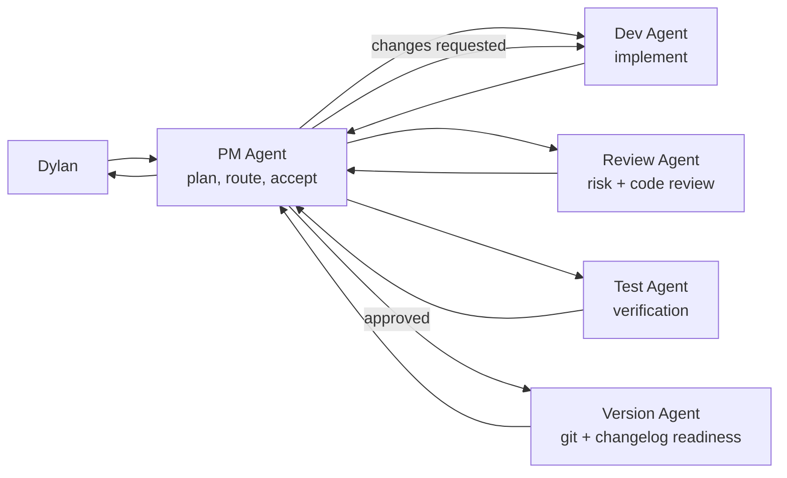

# Dylan Team Loop

<p align="center">
  <strong>PM-led multi-agent delivery loops for Codex</strong>
  <br>
  Turn one project objective into routed Agent work, review loops, verification, git readiness, and a readable project memory.
</p>

<p align="center">
  <a href="https://github.com/DylanZhangzzz/Dylan-Team-loop"></a>
  
  
  
</p>

<p align="center">
  <a href="#quick-install">Quick Install</a> |
  <a href="#why-team-loop">Why Team Loop</a> |
  <a href="#how-the-loop-runs">How It Runs</a> |
  <a href="#roles">Roles</a> |
  <a href="#safety-model">Safety</a>
</p>

## What Is Dylan Team Loop?

Dylan Team Loop is a Codex skill for running a small AI delivery team around one PM Agent.

Instead of prompting a coding agent again and again, Dylan gives the PM Agent an objective. The PM Agent plans the work, routes structured tasks to role Agents, collects results, runs review and test loops, records decisions, and stops when human approval is required.

```text
Dylan -> PM Agent -> Dev Agent -> Review Agent + Test Agent -> Dev repair loop -> Version Agent -> Dylan
```

It is built for projects where you want the speed of multiple Agents without losing the thread: who was assigned what, what changed, what passed, what is blocked, and when Dylan must decide.

## Quick Install

Install the Codex skill from GitHub:

```bash
tmp="$(mktemp -d)"
trap 'rm -rf "$tmp"' EXIT

git clone --depth 1 https://github.com/DylanZhangzzz/Dylan-Team-loop.git "$tmp"
mkdir -p ~/.codex/skills/dylan-team-loop
rsync -a "$tmp"/ ~/.codex/skills/dylan-team-loop/
```

If the repository is private, authenticate GitHub access first, then run the same commands.

Or install from a local clone:

```bash
mkdir -p ~/.codex/skills/dylan-team-loop
rsync -a ./ ~/.codex/skills/dylan-team-loop/
```

Then restart Codex or start a fresh Codex thread so the skill is discovered.

## Initialize A Project

Create the project-local Team Loop workspace:

```bash
python3 ~/.codex/skills/dylan-team-loop/scripts/init_team_loop.py \
  --project-name "ExampleProject" \
  --project-path /path/to/project
```

This creates:

```text
team-loop/
  agent-profiles/
  knowledge/
  agents.json
  messages.ndjson
  commits.ndjson
  decisions.ndjson
  progress.md
  protocol.md
```

Before creating worktree-backed Dev or Test Agents, check whether the repo has a valid git `HEAD`:

```bash
python3 ~/.codex/skills/dylan-team-loop/scripts/check_worktree_ready.py \
  --project-path /path/to/project
```

If `readyForWorktree` is `false`, create an initial commit first or run Agents in the local project environment until a valid `HEAD` exists.

## Start The PM Agent In Codex

Open Codex in the target project and ask:

```text
Use the dylan-team-loop skill.

You are the PM Agent for this project.
Read team-loop/protocol.md, team-loop/agents.json, team-loop/progress.md,
and team-loop/agent-profiles/pm.md before acting.

Wait for my project objective before dispatching work.
```

Once Dylan approves a plan, the PM Agent can route `TEAMLOOP_MESSAGE v1` tasks to the role Agents and update the project logs after each loop iteration.

## Why Team Loop

| Problem | Team Loop answer |
|---|---|
| One agent loses context over long work | PM keeps durable state in `team-loop/` files |
| Parallel Agents create chaos | Every task uses `TEAMLOOP_MESSAGE v1` with return fields |
| Reviews happen too late | Review and Test Agents are part of the default loop |
| Worktrees fail on empty repos | Preflight detects missing `HEAD` before worktree creation |
| Automation can overreach | Admin boundaries require Dylan confirmation |
| Good prompts disappear in chat history | Role profiles and knowledge files live in the repo |

## How The Loop Runs



The PM Agent may loop automatically after Dylan approves the plan:

```text
PM -> Dev -> PM
PM -> Review + Test -> PM
PM -> Dev repair loop
PM -> Version -> PM
PM -> Dylan
```

The loop stops for Dylan when requirements are unclear, credentials or hardware are missing, repeated failures do not converge, or an admin action is required.

## Roles

| Agent | Default mode | Job |
|---|---:|---|
| PM | coordinator | Plans, routes, tracks status, accepts work, reports to Dylan |
| Dev | worktree | Implements features, bug fixes, and scoped code changes |
| Test | worktree | Designs tests, reproduces bugs, and verifies acceptance criteria |
| Review | readonly | Reviews diffs, architecture risk, regression risk, and test quality |
| Version | readonly | Checks git status, commit scope, changelog, and release readiness |
| Research | readonly | Looks up docs, dependencies, options, and technical unknowns |
| UX | readonly | Reviews product flow, UI behavior, accessibility, and visual quality |
| FW | optional readonly | Firmware, embedded, hardware, RTOS, device logs |
| ML | optional worktree | Model selection, training strategy, evaluation, leakage risk |

Include firmware or ML roles at initialization:

```bash
python3 ~/.codex/skills/dylan-team-loop/scripts/init_team_loop.py \
  --project-name "FirmwareProject" \
  --project-path /path/to/project \
  --project-type firmware

python3 ~/.codex/skills/dylan-team-loop/scripts/init_team_loop.py \
  --project-name "MLProject" \
  --project-path /path/to/project \
  --project-type ml
```

## TEAMLOOP_MESSAGE v1

Every cross-Agent dispatch uses the same searchable envelope:

```text
TEAMLOOP_MESSAGE v1
project: <project-name>
mode: <task|goal|review>
from_role: <pm|dev|test|version|review|research|ux|fw|ml>
to_role: <pm|dev|test|version|review|research|ux|fw|ml>
message_id: <timestamp-role-counter>
requires_response: <yes|no>
response_to: <message_id or none>
priority: <low|normal|high|urgent>

Context:
<short context>

Task:
<concrete request>

Acceptance:
- <observable result>
- <verification command or evidence required>

Return Format:
- Summary
- Files changed
- Commands run
- Risks/blockers
- Next recommended action
END_TEAMLOOP_MESSAGE
```

This makes Agent work auditable. Dispatches and response summaries go to `team-loop/messages.ndjson`; decisions go to `team-loop/decisions.ndjson`; version and commit events go to `team-loop/commits.ndjson`.

## Safety Model

The PM Agent may coordinate work and read Agent results after Dylan approves execution. It must stop for Dylan confirmation before:

- installing third-party skills;
- deleting or merging branches;
- rewriting public history;
- making a formal release;
- continuing when credentials, hardware, or product decisions are missing.

Version Agent may create branches, commits, and changelog/version edits only after PM approval. Branch deletion, branch merge, public history rewrites, and releases require Dylan confirmation.

## Codex Support Today

Dylan Team Loop is Codex-first today:

- Codex skills live under `~/.codex/skills/`.
- Codex threads act as role Agents.
- Codex worktrees can isolate Dev/Test once the project has a valid `HEAD`.
- Codex thread tools can send and read Agent messages.

The method is designed to be portable, but only Codex support is documented as ready in this repository.

## Future Adapters

| Adapter | Status | Notes |
|---|---|---|
| Codex | supported now | Primary target for this skill |
| Claude Code | reserved | Feasible if role threads, skills, and message routing are mapped cleanly |
| Hermes | reserved | Feasibility depends on available Agent, state, and dispatch primitives |

## Recommended First Run

1. Install the skill.
2. Initialize `team-loop/` in a real project.
3. Create an initial git commit if the project has none.
4. Start a PM Agent thread in Codex.
5. Ask the PM to propose a plan.
6. Approve the plan.
7. Let PM run Dev -> Review/Test -> Version.
8. Read the final PM report and inspect the logs.

## Project Files As Memory

| File | Purpose |
|---|---|
| `team-loop/agents.json` | Role registry, thread IDs, workspace modes, responsibilities |
| `team-loop/progress.md` | Human-readable state, blockers, loop iteration, next action |
| `team-loop/messages.ndjson` | Dispatches and response summaries |
| `team-loop/decisions.ndjson` | Dylan approvals, PM approvals, scope changes, escalations |
| `team-loop/commits.ndjson` | Commit proposals, branch actions, changelog/version checks |
| `team-loop/agent-profiles/*.md` | Role-specific operating instructions |
| `team-loop/knowledge/*.md` | Project facts that Agents should reuse |

## Repository Layout

```text
.
  SKILL.md
  README.md
  agents/
    openai.yaml
  references/
    protocol.md
    roles.md
    project-files.md
    agent-skill-recommendations.md
  scripts/
    init_team_loop.py
    check_worktree_ready.py
    log_teamloop_event.py
```

## Development From Source

Clone the repo, inspect the scripts, and install locally:

```bash
git clone https://github.com/DylanZhangzzz/Dylan-Team-loop.git
cd Dylan-Team-loop

python3 scripts/check_worktree_ready.py --project-path .

mkdir -p ~/.codex/skills/dylan-team-loop
rsync -a ./ ~/.codex/skills/dylan-team-loop/
```

## License

Add a license file before publishing this as a reusable open-source package.
