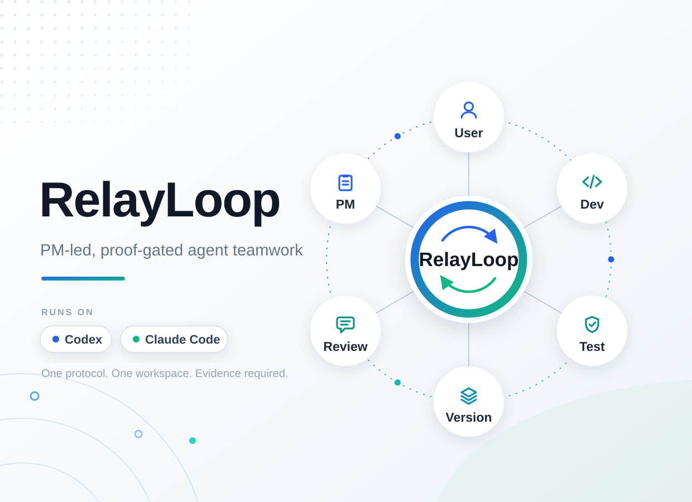
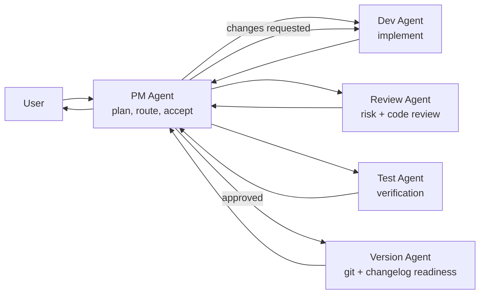

<div align="center">

# RelayLoop

**PM-led engineering loops for Codex & Claude Code agent teams**

Platforms run your agents. **RelayLoop makes their work provable** —<br>
turning one objective into dispatched Agent work, evidence-gated review loops,<br>
and durable repo-local project state.

<br>

<a href="https://github.com/DylanZhangzzz/RelayLoop"></a>


<br>

[Quick Install](#-quick-install) ·
[Why RelayLoop](#-why-relayloop) ·
[How It Runs](#-how-the-loop-runs) ·
[Roles](#-roles) ·
[Protocol](#-relayloop_message-v1) ·
[Bring Your Own Agents](#-bring-your-own-agents) ·
[Safety](#-safety-model)

English | [简体中文](./README.zh-CN.md)

<br>



</div>

---

## 🚀 What Is RelayLoop?

RelayLoop is a **PM-led, evidence-gated delivery layer for engineering agent teams** — Codex-first, with a supported Claude Code adapter.

Agent platforms keep getting better at *running* agents in parallel: Codex threads, Claude Code subagents, mission-control dashboards. What no platform owns is the delivery contract — who was assigned what, what proof "done" requires, and where the auditable record lives. RelayLoop is that contract layer. Every platform improvement in running agents makes the loop faster; the contract stays the same.

It is not a generic agent framework and not an agent group chat. It is a lightweight, repo-local operating system for Codex Desktop and Codex threads: the User gives the PM Agent an objective; PM routes structured work to role Agents; the PM Agent maintains the RelayLoop progress file (`relay-loop/progress.md`) as the active single source of truth; Agents return results with evidence; audit logs land in the repo; and the loop stops whenever User approval is required.

```text
User
  -> PM Agent
     -> RelayLoop progress file  (relay-loop/progress.md)
     -> Dev
     -> Review + Test
     -> Dev repair loop
     -> Version
  -> User
```

**At a glance:**

- 🎯 **PM-led dispatch** — PM assigns work to the right role Agent instead of letting a chat drift.
- 🔒 **Proof-Gated Loop** — every dispatch includes acceptance criteria and required proof before work can be called done.
- 📋 **RelayLoop progress file** (`relay-loop/progress.md`) — the active source of truth for assignments, returns, blockers, approvals, and next action.
- 🧭 **Project Harness** — `AGENTS.md` and `specs/` turn project intent into role contracts.
- 🧾 **Audit logs and approval gates** — messages, decisions, commits, and admin stops are repo-local.

It is built for real engineering work where you want the speed of multiple Agents without losing the thread: who was assigned what, what changed, what passed, what is blocked, and when a human decision is needed.

## 📦 Quick Install

### Codex Skill + Project Init

Install the Codex skill first. This is the primary path for the PM-led workflow because Codex discovers RelayLoop from `~/.codex/skills`.

```bash
tmp="$(mktemp -d)"
trap 'rm -rf "$tmp"' EXIT

git clone --depth 1 https://github.com/DylanZhangzzz/RelayLoop.git "$tmp"
mkdir -p ~/.codex/skills/relayloop
rsync -a "$tmp"/ ~/.codex/skills/relayloop/
```

If the repository is private, authenticate GitHub access first, then run the same commands.

Or install from a local clone:

```bash
mkdir -p ~/.codex/skills/relayloop
rsync -a ./ ~/.codex/skills/relayloop/
```

Then restart Codex or start a fresh Codex thread so the skill is discovered.

Initialize a project with the Python initializer:

```bash
python3 ~/.codex/skills/relayloop/scripts/init_relay_loop.py \
  --project-name "ExampleProject" \
  --project-path /path/to/project
```

This creates the project-local RelayLoop workspace (`relay-loop/`) used by the PM Agent, role Agents, progress file, and audit logs.

### Claude Code

The same skill runs under Claude Code — install it to `~/.claude/skills/` and initialize with the Claude Code adapter:

```bash
mkdir -p ~/.claude/skills/relayloop
rsync -a "$tmp"/ ~/.claude/skills/relayloop/

python3 ~/.claude/skills/relayloop/scripts/init_relay_loop.py \
  --project-name "ExampleProject" \
  --project-path /path/to/project \
  --adapter claude-code
```

`--adapter claude-code` additionally generates `.claude/agents/relayloop-<role>.md` subagent definitions: the main Claude Code session acts as the PM Agent and dispatches `RELAYLOOP_MESSAGE v1` tasks to the role subagents. The protocol, workspace, and audit logs are identical across both platforms. See [references/adapters/claude-code.md](./references/adapters/claude-code.md) for the concept mapping and the agent-teams / multi-session modes.

### Optional Specialist Import CLI

Install the RelayLoop CLI from the current GitHub repository when you want the `relayloop specialists import` helper:

```bash
npm install -g github:DylanZhangzzz/RelayLoop
relayloop --help
relayloop specialists import --help
```

The GitHub npm CLI currently helps with approved local Markdown specialist imports. It does not install the Codex skill, create Codex Agent threads, or initialize the full PM-led workflow by itself. The GitHub repository path is `DylanZhangzzz/RelayLoop`; the package and product name are RelayLoop. This is not an npm registry publication claim.

## 🛠 Initialize A Project

Create or recreate the project-local RelayLoop workspace:

```bash
python3 ~/.codex/skills/relayloop/scripts/init_relay_loop.py \
  --project-name "ExampleProject" \
  --project-path /path/to/project
```

This creates:

```text
relay-loop/
  agent-profiles/
  knowledge/
  agents.json
  messages.ndjson
  commits.ndjson
  decisions.ndjson
  progress.md
  protocol.md
```

For app repositories, optionally scaffold the native RelayLoop Project Harness at initialization:

```bash
python3 ~/.codex/skills/relayloop/scripts/init_relay_loop.py \
  --project-name "ExampleApp" \
  --project-path /path/to/app \
  --include-project-harness
```

This creates `AGENTS.md`, `specs/project-spec.md`, `specs/acceptance-criteria.md`, `specs/modules/.gitkeep`, and a `.gitignore` entry for `.agent-runs/` outside the RelayLoop workspace (`relay-loop/`). These files are pending placeholders until PM completes grill-me discovery Q&A with the User. Project Harness turns project intent into role contracts: Dev reads the project map/spec, Test uses acceptance criteria as the evidence contract, Review checks diffs against boundaries, and UX aligns to user scenarios. Use `--dry-run` to preview planned writes and skips.

Before creating worktree-backed Dev or Test Agents, check whether the repo has a valid git `HEAD`:

```bash
python3 ~/.codex/skills/relayloop/scripts/check_worktree_ready.py \
  --project-path /path/to/project
```

If `readyForWorktree` is `false`, create an initial commit first or run Agents in the local project environment until a valid `HEAD` exists.

> [!NOTE]
> **Migrating from `team-loop/`?** Earlier versions stored the workspace at `team-loop/`. The initializer detects and reuses an existing legacy `team-loop/` workspace instead of creating a second one, and the CLI accepts `--team-loop-dir` as a deprecated alias of `--relay-loop-dir`. New projects always get `relay-loop/`.

## ▶️ Start The PM Agent In Codex

Open Codex in the target project and ask:

```text
Use the relayloop skill.

You are the PM Agent for this project.
Read relay-loop/protocol.md, relay-loop/agents.json, relay-loop/progress.md,
and relay-loop/agent-profiles/pm.md before acting.

Wait for my project objective before dispatching work.
```

Once the User approves a plan, the PM Agent defaults to routing `RELAYLOOP_MESSAGE v1` tasks to the role Agents and updating the project logs after each loop iteration. PM should not do implementation or documentation work inline when an appropriate live Agent thread exists.

## 💡 Why RelayLoop

| Problem | RelayLoop answer |
|---|---|
| Generic frameworks feel heavy | Install one Codex skill and initialize one RelayLoop workspace (`relay-loop/`) inside an existing repo |
| Agent group chats blur responsibility | PM, Dev, Test, Review, Version, Research, and UX have explicit lanes |
| One agent loses context over long work | PM keeps a living project dashboard in the RelayLoop progress file (`relay-loop/progress.md`) |
| Parallel Agents create chaos | Every dispatch uses `RELAYLOOP_MESSAGE v1` with required return fields |
| Agents self-report "done" without proof | PM defines acceptance; Test and Review verify evidence before approval |
| Reviews happen too late | Review and Test Agents are part of the default loop |
| Worktrees fail on empty repos | Preflight detects missing `HEAD` before worktree creation |
| Automation can overreach | Admin boundaries require User confirmation |
| Good prompts disappear in chat history | Role profiles and knowledge files live in the repo |

## ✨ What Makes It Different

### Codex-first, not concept-first

Many loop and multi-agent projects are powerful but abstract. RelayLoop is designed to run directly in Codex Desktop with Codex threads: PM sends the task, the Agent replies, the PM logs the result, and the project state updates on disk.

### PM-led, not agent chat

AutoGen-style and crew-style systems often let Agents talk a lot while ownership gets fuzzy. RelayLoop models a real small engineering team: PM plans and routes, Dev implements, Test verifies, Review audits, Version checks git/release readiness, Research investigates, and UX evaluates product flow.

### PM-maintained project progress

Unlike chat-only multi-agent setups, RelayLoop keeps a PM Agent-maintained Project Progress File. The RelayLoop progress file (`relay-loop/progress.md`) is the living project dashboard and active single source of truth: what is assigned, what came back, what is blocked, what needs User approval, and what happens next. PM updates it after every loop iteration.

It tracks:

- current state: `planned`, `assigned_dev`, `review_testing`, `changes_requested`, `approved`, `versioning`, `reported`;
- current loop iteration and limit;
- each Agent's status;
- recently dispatched tasks and returned results;
- blockers, risks, and User decision needs;
- next action.

That makes the loop resilient to context drift and state loss.

### Proof-Gated Loop

RelayLoop does not treat "the Agent says it is done" as done. Every PM dispatch is an **Acceptance-First Dispatch**: PM writes the task and the acceptance criteria together.

Each dispatch must define:

- the user-observable result;
- commands and checks that must pass;
- files, pages, screenshots, logs, or other evidence that must be returned;
- how Test Agent should judge pass/fail.

Then Test validates the acceptance criteria with evidence, Review checks code/architecture/regression risk and proof gaps, and PM routes any failure back to Dev. That makes the loop evidence-driven instead of chat-driven.

For UI work, code inspection is not enough when the app can run locally. Acceptance should require the app or route to be opened in a browser, desktop/mobile screenshots when relevant, viewport and operation steps in the Test response, and a fail result for blank screens, overlapping text, broken controls, unusable flows, console errors, or visual regressions.

### Repo-local memory

The RelayLoop workspace (`relay-loop/`) is the durable spine:

- `agents.json` records Agent threads, roles, workspace modes, and responsibilities.
- `messages.ndjson` records dispatches and response summaries.
- `decisions.ndjson` records approvals, scope changes, and escalations.
- `progress.md` is the PM-maintained project dashboard for state, assignments, returned results, blockers, decisions, loop limits, Agent status, and next action.

That makes the loop auditable, recoverable, and handoff-friendly in a way pure chat history is not.

### Safety boundaries for real engineering

The loop is intentionally not fully autonomous by default. Installing third-party skills, deleting or merging branches, rewriting public history, and making formal releases stop for User approval. That makes it easier to trust the system on real repositories.

### User-in-the-loop by design

RelayLoop keeps the User as the decision owner. Agents can plan, implement, test, review, and prepare versioning work, but the User remains responsible for scope, approval gates, admin actions, and final trust. PM records those decisions in the project-local progress and decision logs so automation stays accountable.

### Lightweight by default

No service, dashboard, database, or complex runtime is required. Install the skill, initialize the harness, create/register Codex role threads, and run the loop inside the repo you already have.

## 🔄 How The Loop Runs


```mermaid
flowchart LR
    U["User"] --> PM["PM Agent<br/>plan, route, accept"]
    PM --> DEV["Dev Agent<br/>implement"]
    DEV --> PM
    PM --> REV["Review Agent<br/>risk + code review"]
    PM --> TEST["Test Agent<br/>verification"]
    REV --> PM
    TEST --> PM
    PM -->|changes requested| DEV
    PM -->|approved| VER["Version Agent<br/>git + changelog readiness"]
    VER --> PM
    PM --> U
```

The PM Agent may loop automatically after the User approves the plan:

```text
User objective
-> PM task breakdown + acceptance criteria
-> Dev / UX / Research / Specialist execution
-> Test actual acceptance with evidence
-> Review code / architecture / risk / proof gaps
-> PM routes failures back to Dev
-> repeat until accepted or stopped
-> Version git scope / checks / push judgment
-> PM reports User
```

For implementation and documentation tasks, PM sends the work to Dev first with `Task:` and `Acceptance:` sections, then uses Review/Test and UX when appropriate, then asks Version for git, changelog, branch readiness, and safe push checks.

PM may act inline only for trivial read-only status checks, direct answers to the User, urgent admin clarification, or when no live Agent thread exists for the needed role.

The loop stops for the User when requirements are unclear, credentials or hardware are missing, repeated failures do not converge, or an admin action is required.

## 👥 Roles

| Agent | Default mode | Job |
|---|---:|---|
| 🧭 PM | coordinator | Plans, routes, maintains project state, accepts work, reports to the User |
| 🔨 Dev | worktree | Implements features, bug fixes, and scoped code changes |
| 🧪 Test | worktree | Designs tests, reproduces bugs, and verifies acceptance criteria |
| 🔍 Review | readonly | Reviews diffs, architecture risk, regression risk, and test quality |
| 🏷 Version | readonly | Checks git status, commit scope, changelog, and release readiness |
| 📚 Research | readonly | Looks up docs, dependencies, options, and technical unknowns |
| 🎨 UX | readonly | Reviews product flow, UI behavior, accessibility, and visual quality |
| ⚙️ FW | optional readonly | Firmware, embedded, hardware, RTOS, device logs |
| 🤖 ML | optional worktree | Model selection, training strategy, evaluation, leakage risk |

Include firmware or ML roles at initialization:

```bash
python3 ~/.codex/skills/relayloop/scripts/init_relay_loop.py \
  --project-name "FirmwareProject" \
  --project-path /path/to/project \
  --project-type firmware

python3 ~/.codex/skills/relayloop/scripts/init_relay_loop.py \
  --project-name "MLProject" \
  --project-path /path/to/project \
  --project-type ml
```

## 🤝 Bring Your Own Agents

RelayLoop is the team operating system. [agency-agents](https://github.com/msitarzewski/agency-agents) can be an optional specialist talent pool.

RelayLoop owns the PM-led project protocol and state layer: task dispatch, the Agent roster, `RELAYLOOP_MESSAGE v1`, the RelayLoop progress file (`relay-loop/progress.md`), messages and decisions audit logs, the Dev -> Review/Test repair loop, human approval gates, and Codex-first threads, worktrees, or local execution. It does not try to own every specialist persona.

Optional specialist libraries such as agency-agents can provide expert profiles, for example Security Engineer, Backend Architect, UX Researcher, Technical Writer, Performance Engineer, or other domain roles. At the reviewed upstream source, the agency-agents README describes a collection of AI agent personalities and reports 232 specialized agents across 16 divisions. Its agent files are Markdown/profile-style definitions, and its Codex integration can generate standalone TOML custom-agent files for `~/.codex/agents/`.

RelayLoop can wrap approved specialists in its message contract so PM can dispatch them like any other role while keeping project state and audit logs local. RelayLoop should not recommend running third-party convert/install scripts until they have been reviewed.

This is different from framework-centered tools:

| Layer | Role |
|---|---|
| AutoGen / CrewAI | General multi-agent orchestration frameworks |
| agency-agents | Optional role/profile library for specialist personas |
| **RelayLoop** | PM-led project protocol, progress state, audit logs, and approval gates |

Specialist import is available in the RelayLoop CLI. It adapts approved local Markdown only; it does not fetch remote content, run upstream scripts, install Codex agents, or write outside the target RelayLoop workspace (`relay-loop/`).

```bash
relayloop specialists import \
  --relay-loop-dir /path/to/project/relay-loop \
  --profile-file /path/to/approved-profile.md \
  --id security-engineer \
  --display-name "Security Engineer" \
  --source-name agency-agents \
  --source-repo https://github.com/msitarzewski/agency-agents \
  --source-ref 0123456789abcdef0123456789abcdef01234567 \
  --source-path engineering/security-engineer.md \
  --license MIT
```

The command defaults to dry-run and prints a JSON plan. `--profile-file` must point to a local `.md` or `.markdown` file. Use write mode only after the User has approved the source/ref/license metadata. From a checkout, use `node bin/relayloop.js ...`.

## ✉️ RELAYLOOP_MESSAGE v1

Every cross-Agent dispatch uses the same searchable envelope:

```text
RELAYLOOP_MESSAGE v1
project: <project-name>
mode: <task|goal|review>
from_role: <pm|dev|test|version|review|research|ux|fw|ml>
to_role: <pm|dev|test|version|review|research|ux|fw|ml>
message_id: <timestamp-role-counter>
requires_response: <yes|no>
response_to: <message_id or none>
priority: <low|normal|high|urgent>

Context:
<short context>

Task:
<concrete request>

Acceptance:
- <user-observable result>
- <required commands/checks>
- <required files/pages/screenshots/logs as evidence>
- <how Test Agent should judge pass/fail>

Return Format:
- Result: <pass|fail|blocked when validating/reviewing>
- Summary
- Evidence
- Files changed
- Commands run
- Risks/blockers
- Next recommended action
END_RELAYLOOP_MESSAGE
```

This makes Agent work auditable. Dispatches and response summaries go to the RelayLoop message log (`relay-loop/messages.ndjson`); decisions go to the RelayLoop decision log (`relay-loop/decisions.ndjson`); version and commit events go to the RelayLoop commit log (`relay-loop/commits.ndjson`).

`RELAYLOOP_MESSAGE v1` is the canonical v1 protocol token for RelayLoop.

Example Test response:

```text
Result: fail

Evidence:
- Command: npm test passed
- Browser: http://localhost:5173/settings
- Screenshot: /tmp/relay-loop/settings-mobile.png
- Failure: Save button overlaps footer at 390px width

Next recommended action:
- Dev should adjust footer spacing and rerun the mobile viewport check.
```

## 🔎 Validate The Workspace

"Evidence required" is machine-checked, not aspirational. `relayloop validate` lints a workspace or a single message against the v1 protocol:

```bash
relayloop validate --relay-loop-dir /path/to/project/relay-loop
relayloop validate --message-file dispatch.txt        # RELAYLOOP_MESSAGE v1 text
relayloop validate --message-file dispatch.json       # normalized JSON form
```

It checks that `agents.json` matches `relayloop.agents.v1` (including a registered PM), that `progress.md` keeps its required sections and a known loop state, that every NDJSON log line is a well-formed `relayloop.event.v1` event — and it enforces the proof gate: **a message event reporting `result: pass` without non-empty `evidence` is an error.** Envelopes missing `Task:` or `Acceptance:` sections fail too.

Exit codes are CI-friendly (`0` valid, `1` violations, `2` usage), `--json` emits a machine-readable report, and `--strict` turns warnings into failures. The JSON Schema files the validator enforces live in [`schemas/`](./schemas) — they are the interop contract for any harness that wants to read or write a RelayLoop workspace.

## 🛡 Safety Model

The PM Agent may coordinate work and read Agent results after the User approves execution. It must stop for User confirmation before:

- installing third-party skills;
- deleting or merging branches;
- rewriting public history;
- making a formal release;
- continuing when credentials, hardware, or product decisions are missing.

Version Agent may create branches, commits, and changelog/version edits only after PM approval. It may decide to push committed changes when the branch is clean, scope is intended, checks have passed, and the push is not a branch merge/delete, public history rewrite, or formal release.

A push is distinct from a merge or release: safe committed-change pushes are Version Agent judgment calls after readiness checks, while branch deletion, branch merge, public history rewrites, formal releases, and third-party skill installs require User confirmation.

## 🧩 Platform Support

The RelayLoop core — protocol envelope, `relay-loop/` workspace, audit logs, and scripts — is plain text and platform-independent. Platforms compete on running agents; RelayLoop rides that progress: better threads and better subagents just make the loop faster, while the delivery contract stays the same. Platform-specific behavior lives in adapters:

**Codex (primary):**

- Codex skills live under `~/.codex/skills/`.
- Codex threads act as role Agents.
- Codex worktrees can isolate Dev/Test once the project has a valid `HEAD`.
- Codex thread tools can send and read Agent messages.

**Claude Code (supported):**

- Claude Code skills live under `~/.claude/skills/` (or project `.claude/skills/`).
- The main session acts as the PM Agent; role Agents run as generated `relayloop-*` subagents (default), agent teams (experimental), or independent sessions.
- Claude Code worktree isolation covers Dev/Test, with the same `check_worktree_ready.py` preflight.
- Full mapping: [references/adapters/claude-code.md](./references/adapters/claude-code.md).

### Adapters

| Adapter | Status | Notes |
|---|---|---|
| Codex | ✅ supported now | Primary target for this skill |
| Claude Code | ✅ supported now | Subagent mode by default; agent-teams and multi-session modes documented |
| Hermes | 🔜 reserved | Feasibility depends on available Agent, state, and dispatch primitives |

## 🗺 Recommended First Run

1. Install the skill.
2. Initialize the RelayLoop workspace (`relay-loop/`) in a real project.
3. Create an initial git commit if the project has none.
4. Start a PM Agent thread in Codex.
5. Ask the PM to propose a plan.
6. Approve the plan.
7. Let PM run Dev -> Review/Test -> Version.
8. Read the final PM report and inspect the logs.

## 🗂 RelayLoop Workspace Files

The initializer creates the RelayLoop workspace at `relay-loop/`. That directory name is the on-disk storage contract used by the code and tests; existing legacy `team-loop/` workspaces are detected and reused.

- `relay-loop/agents.json` records the role registry, thread IDs, workspace
  modes, and responsibilities.
- `relay-loop/progress.md` is the PM-maintained project dashboard: state, loop
  iteration and limit, Agent status, recent dispatches/results, blockers, User
  decision needs, and next action.
- `relay-loop/messages.ndjson` records dispatches and response summaries.
- `relay-loop/decisions.ndjson` records User approvals, PM approvals, scope
  changes, and escalations.
- `relay-loop/commits.ndjson` records commit proposals, branch actions, and
  changelog/version checks.
- `relay-loop/agent-profiles/*.md` stores role-specific operating instructions.
- `relay-loop/knowledge/*.md` stores project facts that Agents should reuse.

## 📁 Repository Layout

```text
.
  SKILL.md
  README.md
  package.json
  agents/
    openai.yaml
  bin/
    relayloop.js
  lib/
    validate.js
  schemas/
    relayloop.message.v1.schema.json
    relayloop.event.v1.schema.json
    relayloop.agents.v1.schema.json
  references/
    protocol.md
    roles.md
    project-files.md
    specialist-adapters.md
    agent-skill-recommendations.md
    adapters/
      claude-code.md
  scripts/
    init_relay_loop.py
    check_worktree_ready.py
    log_relayloop_event.py
  test/
    relayloop.test.js
    validate.test.js
    test_init_relay_loop.py
```

## 🧑‍💻 Development From Source

Clone the repo, inspect the scripts, and install locally:

```bash
git clone https://github.com/DylanZhangzzz/RelayLoop.git
cd RelayLoop

npm test
python3 -m unittest discover -s test -p 'test_*.py'
node bin/relayloop.js --help
python3 scripts/check_worktree_ready.py --project-path .

mkdir -p ~/.codex/skills/relayloop
rsync -a ./ ~/.codex/skills/relayloop/
```

## 📄 License

RelayLoop is licensed under the Apache License 2.0. See [LICENSE](./LICENSE).

---

<div align="center">
<sub>Built for engineers who want multiple Agents' speed — without losing the thread.</sub>
<br>
<sub><strong>One protocol. One workspace. Evidence required.</strong></sub>
</div>
